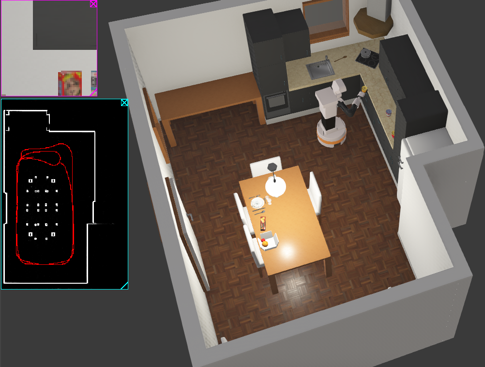
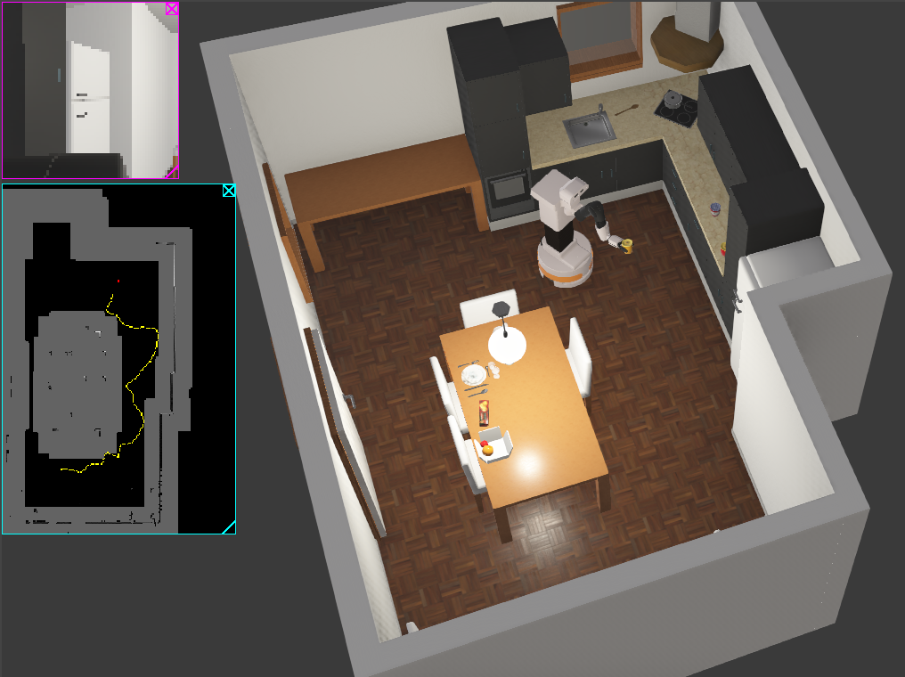
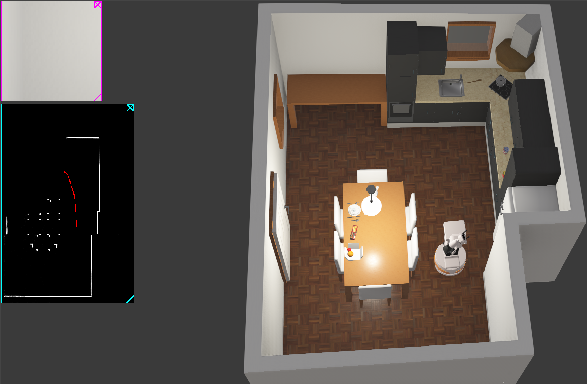
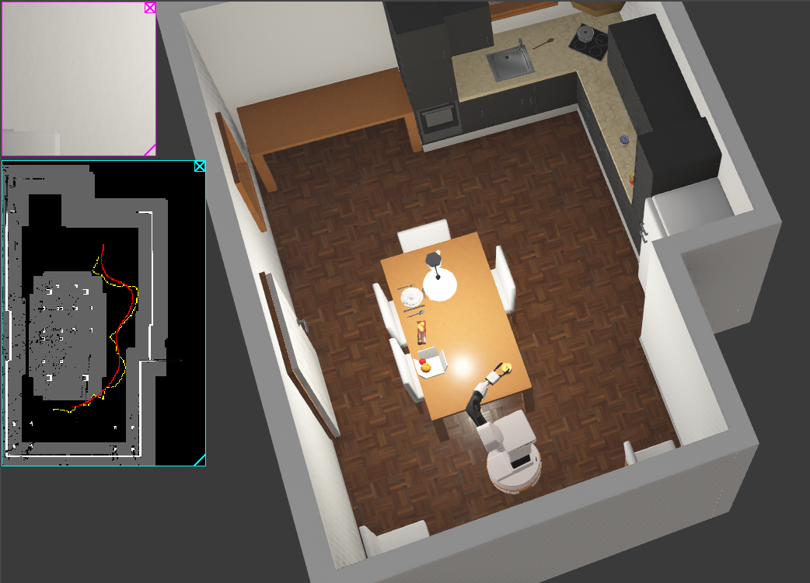
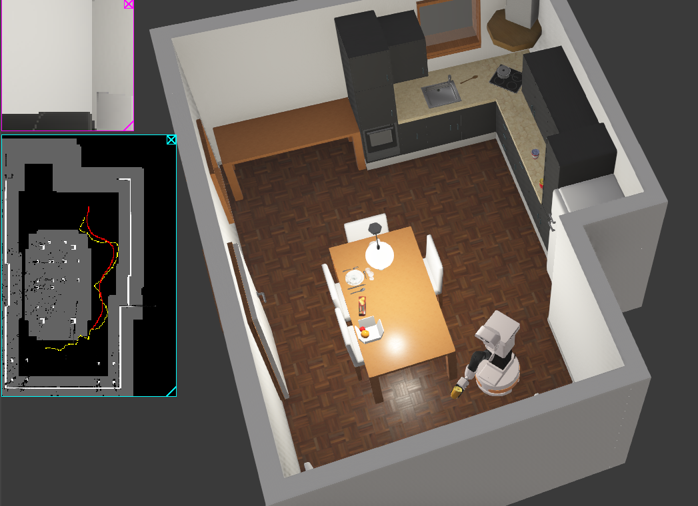
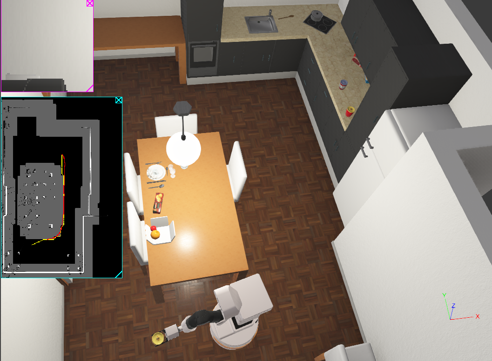
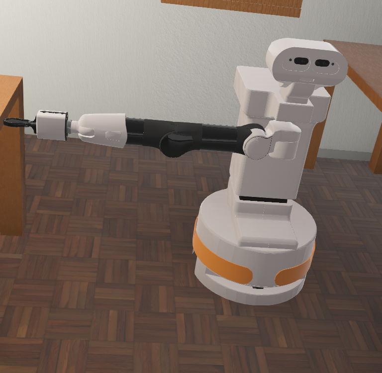

# 🤖 Navigation, Mapping, and Manipulation with TIAGo in Webots

This project showcases a complete autonomous robotic system implemented in Webots using the **TIAGo mobile manipulator**. The robot is capable of simultaneously mapping its environment, planning collision-free paths, detecting and grasping objects, and coordinating all actions through a modular **behavior tree** framework.

Developed entirely in Python, this system integrates **Lidar-based probabilistic mapping**, **Informed RRT\*** path planning, **camera-based object recognition**, and **inverse kinematics manipulation** using **IKPy**. All behaviors are executed using the `py_trees` library for modular, reactive control.

---

## 🌟 Scientific Goals and Technical Objectives

The project was developed to simulate and evaluate real-world robotics tasks using a high-fidelity simulation environment. The goals include:

### 1. **Autonomous Mapping and Environment Perception**
- Real-time Lidar scanning is used to create a **Bayesian Occupancy Grid Map**.
- The robot explores and maps unknown indoor environments using onboard sensors only.

### 2. **Intelligent Navigation**
- Implements multiple path planning algorithms: **A\***, **RRT\***, and **Informed RRT\***.
- Robot plans and follows paths while dynamically avoiding obstacles.

### 3. **Visual Object Detection**
- Uses **Webots camera recognition API** to identify graspable objects based on object ID.
- Converts recognized object positions from camera frame to robot base frame using a transformation matrix based on head and torso joint readings.

### 4. **Grasping with IKPy**
- Uses **IKPy** to calculate joint angles required to reach and grasp detected objects.
- Object manipulation is done with an **underactuated two-finger gripper** and torso lifting for vertical reach.

### 5. **Hierarchical Control with py_trees**
- All tasks are integrated and controlled using **behavior trees** with the `py_trees` library.
- Allows modular decision-making and fail-safe execution for search, navigation, and manipulation.

---

## 💡 Industrial Relevance

This type of system simulates real-world use cases such as:
- **Warehouse automation** and logistics robots
- **Healthcare assistance** for elderly or disabled users
- **Collaborative robots (cobots)** for structured industrial environments
- **Research and education** in SLAM, AI, and mobile manipulation

---

## 🚀 Features

- 🧠 Modular control with **behavior trees**
- 🗘️ Online **Lidar-based mapping** (Bayesian occupancy grid)
- 🧱 Pathfinding with **A\***, **RRT\***, and **Informed RRT\***
- 📷 **Camera object detection** using Webots recognition
- 🧾 **IKPy-powered grasping** with accurate forward/inverse kinematics
- 🧱 Custom arm logic, torso control, and gripper feedback

---

## 📂 Project Structure

```bash
navigation-mapping-tiago/
├── controllers/
│   └── BT_mapping_navigation_manipulation/
│       ├── BT_mapping_navigation_manipulation.py      # Main behavior tree
│       ├── a_star_planning.py                         # A* path planning
│       ├── draw_map.py                                # Probabilistic map drawing
│       ├── ikpy_camera.py                             # Object detection + IK
│       ├── ikpy_manipulation.py                       # Arm control via IKPy
│       ├── informed_rrt_star_planning.py              # Informed RRT* planning
│       ├── lidar_navigation.py                        # Navigation from Lidar input
│       ├── manipulation.py                            # Manipulation tasks
│       ├── mapping.py                                 # Bayesian mapping logic
│       ├── motor_control.py                           # Low-level wheel control
│       ├── rrt_basic_planning.py                      # Basic RRT planner
│       └── rrt_star_planning.py                       # RRT* planner
├── worlds/
│   ├── kitchenfield.wbt                               # Simulation world
│   └── .kitchenfield.wbproj                           # Webots project file
├── LICENSE
└── README.md
```

---

## 🛠 Requirements

- [Webots](https://cyberbotics.com/#download)
- Python 3.x
- `py_trees`, `ikpy`, `numpy`

```bash
pip install numpy py_trees ikpy
```

---

## ▶️ Run the Simulation

1. Launch **Webots** and open the world `kitchenfield.wbt`.
2. Assign controller `BT_mapping_navigation_manipulation` to the **TIAGo** robot.
3. Press ▶️ to start the simulation.

---

## 📷 Screenshots

### 1. Grasping an object


### 2. Navigation and path planning



### 3. Reaching and placing object



### 4. A* Path Planning Example


### 5. TIAGo close-up


---

## 🎥 Videos

### 1. 🗺️ Mapping and SLAM with TIAGo
**Video:** [Mapping_Navigation_SLAM](https://youtu.be/Xu2YBA7Bv6Y)  
This video demonstrates how the TIAGo robot autonomously explores an unknown environment and builds a probabilistic occupancy grid map using Lidar data. The map is dynamically updated in real time while the robot navigates the space.


### 2. 🌟 Informed RRT* Navigation + Pick & Place
**Video:** [Informed_RRT_Star_Algorithm_Place](https://youtu.be/iWCM9fOswHo)  
This video showcases the robot planning an efficient path to a target object using the Informed RRT* algorithm, aligning with the object, and successfully grasping it using IKPy-based arm control.


### 3. 📍 A* Navigation + Pick & Place
**Video:** [A_Start_Algorithm_Place](https://youtu.be/_Flx3Dq1nKg)  
The robot detects the object using camera recognition, plans a path using the A* algorithm, and then executes precise manipulation steps to pick and place the object at a predefined location.


---

## 📄 License

Licensed under the [MIT License](LICENSE). Use and modify freely with attribution.

---

## 👤 Author

**Yassine Louchi**  
GitHub: [Argon719](https://github.com/Argon719)
Email: yassinelouchi.sf@gmail.com

---

## 🙏 Acknowledgements

- [Cyberbotics Webots](https://cyberbotics.com)
- [IKPy](https://github.com/Phylliade/ikpy)
- [py_trees](https://github.com/splintered-reality/py_trees)

Feel free to fork and contribute!
